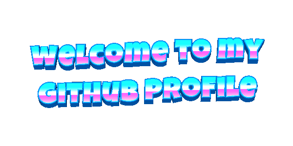
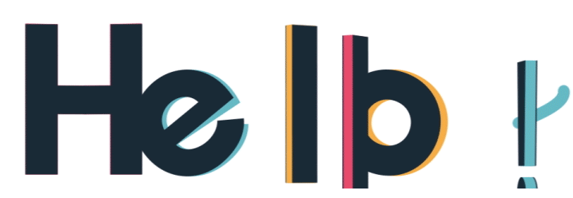

# 👋 Hey, I'm Dalalight

### `Developer` · `Tech Enthusiast` · `Problem Solver`

I build interactive experiences and useful web applications, learning through real projects.

**I love code**&nbsp;&nbsp;&nbsp;&nbsp;**and unicorns**&nbsp;&nbsp;

 

---

## 🖐️ About Me

- **Name:** Dalalight
- **Role:** Developer & student
- **Currently learning:** Python, JavaScript, and web development
- **Interests:** Building projects, open source, and exploring new technologies
- **Goal:** Keep learning, keep building, and keep growing.

I enjoy turning creative ideas into real applications and am open to collaboration, open-source projects, and learning together. Every expert was once a beginner.

 

## ✨ What I Build

- **Interactive 3D experiences** — procedural environments and gameplay with React and Three.js.
- **Workflow applications** — clear, dependable features for real request and approval processes.
- **Developer tools** — small utilities that make everyday tasks easier.

## 🧰 Tech Stack & Tools

## 👾 Pac-Man Contribution Graph

<picture>
  <source media="(prefers-color-scheme: dark)" srcset="https://raw.githubusercontent.com/DaliceZ/DaliceZ/output/pacman-contribution-graph-dark.svg">
  <source media="(prefers-color-scheme: light)" srcset="https://raw.githubusercontent.com/DaliceZ/DaliceZ/output/pacman-contribution-graph.svg">
  
</picture>

## 🚀 Featured Projects

<table>
  <tr>
    <td align="center" width="50%">
      
       
      <strong>Procedural space exploration</strong>
       
      A 3D exploration game built with React, TypeScript, and Three.js.
    </td>
    <td align="center" width="50%">
      
       
      <strong>ToolsDice</strong>
       
      A collection of tools and experiments. Explore the repository for details.
    </td>
  </tr>
</table>

## 📊 GitHub Stats

 

## 🌐 Connect

---

### 💙 Thanks for stopping by!

*“First, solve the problem. Then, write the code.”*

